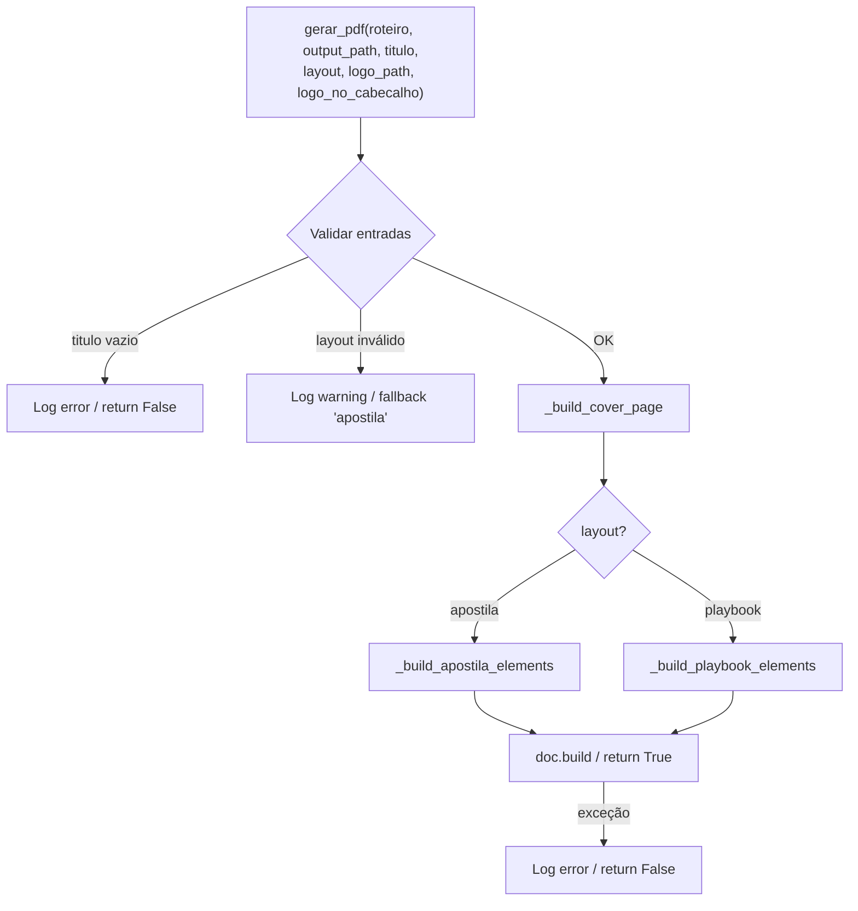

# Design Document — Manual Builder Improvements

## Overview

Este documento detalha o design técnico das melhorias do `pdf_eng/manual_builder.py`. O objetivo é introduzir dois layouts de geração (Apostila e Playbook), uma capa padronizada com identidade visual, suporte a logo e tratamento aprimorado de passos especiais — tudo mantendo compatibilidade total com o pipeline existente (`api/rerender_pipeline.py`).

A implementação usa exclusivamente as bibliotecas já presentes no projeto (`reportlab`, `Pillow`) e adiciona dois novos parâmetros opcionais à função `gerar_pdf`, preservando o comportamento atual quando chamada da forma existente.

---

## Architecture

O módulo permanece um único arquivo Python sem estado externo. A mudança arquitetural principal é a separação interna em funções auxiliares especializadas por responsabilidade, substituindo o loop monolítico atual.



### Decisões de design

- **Sem subclasses ou herança** — a lógica dos layouts é separada em funções privadas `_build_apostila_elements` e `_build_playbook_elements`. Isso mantém o módulo simples e alinhado ao estilo atual.
- **Cover page via `Flowable` customizado** — a capa usa a classe `_CoverPage(Flowable)` do reportlab com `canv.nextPage()` explícito, garantindo que ocupe exatamente uma página completa antes do conteúdo.
- **Logo scaling como função pura** — `_scale_image(w, h, max_w, max_h)` é isolado para facilitar testes e reutilização (cover e header usam limites diferentes).
- **Playbook grid via `Table`** — o reportlab já tem suporte nativo a tabelas com células de tamanho fixo; usar `Table` evita cálculos manuais de posicionamento XY.
- **Backward compatibility** — os novos parâmetros são keyword-only com defaults; a chamada atual `gerar_pdf(roteiro, pdf_path, titulo)` continua funcionando sem mudança.

---

## Components and Interfaces

### Função pública

```python
def gerar_pdf(
    roteiro: list,
    output_path: str,
    titulo: str,
    layout: str = "apostila",
    logo_path: str | None = None,
    logo_no_cabecalho: bool = False,
) -> bool:
    """
    Gera apostila PDF a partir de um roteiro de tutorial.

    Args:
        roteiro:          Lista de dicionários com os passos do tutorial.
        output_path:      Caminho do arquivo PDF de saída.
        titulo:           Título do documento (exibido na capa).
        layout:           "apostila" (padrão) ou "playbook". Valor inválido
                          faz fallback para "apostila" com aviso no log.
        logo_path:        Caminho para arquivo PNG/JPEG da logo.
                          None = sem logo.
        logo_no_cabecalho: Se True e logo_path válido, exibe a logo no
                          cabeçalho de cada página de conteúdo.

    Returns:
        True  — PDF gravado com sucesso.
        False — titulo vazio, ou qualquer exceção durante a geração.
    """
```

### Funções internas

| Função | Assinatura | Responsabilidade |
|---|---|---|
| `_validate_layout` | `(layout: str) -> str` | Retorna layout normalizado; loga warning e retorna `"apostila"` em caso inválido |
| `_scale_image` | `(orig_w, orig_h, max_w, max_h) -> (w, h)` | Escala proporcional scale-down only |
| `_load_logo` | `(logo_path: str, max_w, max_h) -> Image \| None` | Carrega logo e aplica `_scale_image`; loga warning em caso de erro |
| `_build_cover` | `(titulo, logo_path, styles) -> list[Flowable]` | Constrói elementos da capa |
| `_build_header_canvas` | `(canvas, doc, logo_path)` | Callback `onPage` do reportlab para cabeçalho com logo |
| `_build_apostila_elements` | `(roteiro, styles, logo_path, logo_no_cabecalho) -> list[Flowable]` | Elementos de conteúdo no layout apostila |
| `_build_playbook_elements` | `(roteiro, styles, logo_path, logo_no_cabecalho) -> list[Flowable]` | Elementos de conteúdo no layout playbook |
| `_filter_step` | `(passo: dict) -> bool` | Retorna True se o passo deve ser ignorado |
| `_is_special_step` | `(passo: dict) -> bool` | Retorna True para passo 0 ou 999 |

---

## Data Models

Não há novos modelos de dados externos. O módulo recebe e consome a estrutura de roteiro já existente.

### Estrutura esperada de `passo` (sem mudanças)

```python
{
    "passo": int,                   # Número do passo (0=intro, 999=conclusão, demais=regular)
    "ancora": str,                  # Título/âncora do passo
    "micro_narracao": str,          # Narração curta do passo
    "_simlink": {
        "screenshot_path": str,     # Caminho local do screenshot
        "action": str               # Tipo de ação (ex: "navigation")
    }
}
```

### Constantes de layout

```python
# Dimensões de página
APOSTILA_PAGESIZE = A4                        # 595.28 x 841.89 pt (retrato)
PLAYBOOK_PAGESIZE = landscape(A4)             # 841.89 x 595.28 pt (paisagem)

# Margens (ambos os layouts)
MARGIN = 2 * cm

# Largura útil apostila: A4_width - 2*MARGIN = ~170mm
# Largura de coluna playbook: (landscape_width - 3*MARGIN) / 2 ≈ ~128mm

# Limites de logo
LOGO_COVER_MAX_W = 5 * cm
LOGO_COVER_MAX_H = 5 * cm    # mantém proporção, limite de largura é o primário
LOGO_HEADER_MAX_H = 1 * cm   # limite de altura; largura calculada proporcionalmente

# Cor principal da identidade visual
COR_PRINCIPAL = HexColor("#00998F")

# Layouts válidos
VALID_LAYOUTS = {"apostila", "playbook"}
```

### Estilos ReportLab

Os estilos serão atualizados para usar `COR_PRINCIPAL` em `estilo_ancora` e `estilo_passo_num`, substituindo as cores atuais (`#2d6a4f` e `#6b7280`).

```python
estilo_secao_titulo  # Cor_Principal para títulos de seção
estilo_passo_num     # Cor_Principal para labels "Passo N"
estilo_ancora        # Cor_Principal para âncoras
```

---

## Correctness Properties

*A property is a characteristic or behavior that should hold true across all valid executions of a system — essentially, a formal statement about what the system should do. Properties serve as the bridge between human-readable specifications and machine-verifiable correctness guarantees.*

### Property 1: Layout apostila produz página A4 retrato

*Para qualquer* roteiro válido, chamar `gerar_pdf` com `layout="apostila"` deve produzir um PDF cujas páginas de conteúdo têm dimensões de A4 retrato (largura ≤ altura, ~210×297 mm / 595×842 pt).

**Validates: Requirements 1.2, 1.6**

---

### Property 2: Layout playbook produz página A4 paisagem

*Para qualquer* roteiro válido, chamar `gerar_pdf` com `layout="playbook"` deve produzir um PDF cujas páginas de conteúdo têm dimensões de A4 paisagem (largura > altura, ~297×210 mm / 842×595 pt).

**Validates: Requirements 1.3**

---

### Property 3: Layout inválido faz fallback para apostila

*Para qualquer* string que não seja `"apostila"` nem `"playbook"`, chamar `gerar_pdf` com esse valor de `layout` deve produzir um PDF com as mesmas dimensões de página que `layout="apostila"` produziria para o mesmo roteiro.

**Validates: Requirements 1.5**

---

### Property 4: Omissão de layout equivale a layout="apostila"

*Para qualquer* roteiro válido e título não vazio, chamar `gerar_pdf(roteiro, path, titulo)` deve retornar o mesmo resultado (`True`) e gerar um PDF com páginas em formato A4 retrato, idêntico ao comportamento de `layout="apostila"`.

**Validates: Requirements 1.6, 4.2**

---

### Property 5: Scale-down preserva proporção e nunca amplia

*Para quaisquer* dimensões de imagem originais `(W, H)` e limites de célula `(max_w, max_h)`, a função `_scale_image` deve garantir que: (a) a largura resultante ≤ `max_w` e altura resultante ≤ `max_h`; (b) a proporção original é preservada (`result_w / result_h ≈ W / H`); (c) a imagem nunca é ampliada além de suas dimensões originais (`result_w ≤ W` e `result_h ≤ H`).

**Validates: Requirements 1.4, 2.4, 3.4**

---

### Property 6: Título vazio retorna False

*Para qualquer* string que seja vazia ou composta apenas de espaços em branco usada como `titulo`, `gerar_pdf` deve retornar `False` sem gerar o arquivo de saída.

**Validates: Requirements 2.8**

---

### Property 7: Todo PDF gerado com sucesso começa com capa

*Para qualquer* roteiro válido e título não vazio, um PDF gerado com sucesso (retorno `True`) deve ter ao menos uma página e a primeira página deve corresponder à capa (sem conteúdo de passos do roteiro).

**Validates: Requirements 2.1**

---

### Property 8: Título aparece na capa do PDF

*Para qualquer* string de título não vazia, o PDF gerado deve conter o texto do título na primeira página (capa).

**Validates: Requirements 2.2**

---

### Property 9: Geração bem-sucedida sempre retorna True

*Para qualquer* roteiro válido, título não vazio e caminho de saída gravável, `gerar_pdf` deve retornar `True`.

**Validates: Requirements 4.3**

---

### Property 10: Passo 0 com âncora não vazia aparece sem label de passo

*Para qualquer* roteiro que contenha um passo com número `0` e âncora com ao menos um caractere não-espaço, o PDF gerado deve conter o texto da âncora, mas não deve conter o label `"Passo 0"`.

**Validates: Requirements 5.1**

---

### Property 11: Passo 999 com âncora não vazia aparece sem label de passo

*Para qualquer* roteiro que contenha um passo com número `999` e âncora com ao menos um caractere não-espaço, o PDF gerado deve conter o texto da âncora, mas não deve conter o label `"Passo 999"`.

**Validates: Requirements 5.2**

---

### Property 12: Passos especiais com âncora vazia são ignorados

*Para qualquer* roteiro onde os passos 0 ou 999 tenham âncora nula, vazia ou composta apenas de espaços, o PDF resultante deve ser idêntico (mesmo número de páginas e conteúdo) ao gerado com esses passos removidos do roteiro.

**Validates: Requirements 5.3**

---

### Property 13: Passos regulares sem conteúdo são ignorados

*Para qualquer* roteiro onde um passo regular (número ≠ 0 e ≠ 999) tenha `ancora` e `micro_narracao` ambos vazios ou apenas espaços, o PDF resultante deve ser idêntico ao gerado com esse passo removido.

**Validates: Requirements 5.4**

---

## Error Handling

| Situação | Comportamento |
|---|---|
| `titulo` vazio ou só espaços | `logger.error(...)` + `return False` (antes de criar o doc) |
| `layout` inválido | `logger.warning(f"Layout inválido '{layout}', usando 'apostila'")` + fallback |
| `logo_path` não-None mas arquivo inexistente | `logger.warning(f"Logo não encontrada: {logo_path}")` + continua sem logo |
| `logo_path` existente mas formato não suportado / ilegível | `logger.warning(...)` com descrição do erro + continua sem logo |
| Qualquer exceção não tratada em `gerar_pdf` | `logger.error(f"Erro ao gerar PDF: {type(e).__name__}: {e}")` + `return False` |
| Screenshot de passo regular inexistente ou ilegível | `logger.warning(f"Screenshot do passo {num} não pôde ser inserido: {e}")` + continua sem imagem (comportamento atual mantido) |

Todas as exceções são capturadas no bloco `try/except` externo de `gerar_pdf`. A função **nunca** propaga exceções ao chamador.

---

## Testing Strategy

### Abordagem geral

O módulo usa lógica pura e computável (scaling de imagens, filtragem de passos, formatação de texto) combinada com a geração de arquivos PDF. Isso o torna adequado para uma combinação de:

- **Testes de propriedade (Hypothesis)**: para funções puras como `_scale_image`, filtragem de passos, e verificação de invariantes do PDF gerado.
- **Testes de exemplo**: para casos específicos como assinatura de função, comportamento com logo inválida, capa com cor correta.

### Biblioteca de property-based testing

**[Hypothesis](https://hypothesis.readthedocs.io/)** — já presente no projeto (evidenciado pela pasta `.hypothesis/` na raiz).

### Configuração

- Cada teste de propriedade deve rodar no mínimo **100 iterações** (padrão do Hypothesis com `@settings(max_examples=100)`).
- Cada teste deve ter um comentário de rastreabilidade:
  - Formato: `# Feature: manual-builder-improvements, Property N: <texto resumido>`

### Testes de propriedade (Hypothesis)

| Teste | Property | Estratégia Hypothesis |
|---|---|---|
| `test_apostila_page_orientation` | Property 1 | `@given(roteiro=valid_roteiro_strategy())` |
| `test_playbook_page_orientation` | Property 2 | `@given(roteiro=valid_roteiro_strategy())` |
| `test_invalid_layout_fallback` | Property 3 | `@given(layout=text().filter(lambda s: s not in {"apostila","playbook"}))` |
| `test_default_layout_equiv_apostila` | Property 4 | `@given(roteiro=valid_roteiro_strategy())` |
| `test_scale_image_properties` | Property 5 | `@given(w=integers(1,5000), h=integers(1,5000), max_w=floats(1.0,500.0), max_h=floats(1.0,500.0))` |
| `test_empty_titulo_returns_false` | Property 6 | `@given(titulo=from_regex(r"[ \t\n\r]*"))` |
| `test_pdf_has_cover_page` | Property 7 | `@given(roteiro=valid_roteiro_strategy(), titulo=non_empty_text())` |
| `test_titulo_in_cover` | Property 8 | `@given(titulo=non_empty_text(), roteiro=valid_roteiro_strategy())` |
| `test_success_returns_true` | Property 9 | `@given(roteiro=valid_roteiro_strategy(), titulo=non_empty_text())` |
| `test_step0_no_label` | Property 10 | `@given(ancora=non_empty_text(), regular_steps=list_of_regular_steps())` |
| `test_step999_no_label` | Property 11 | `@given(ancora=non_empty_text(), regular_steps=list_of_regular_steps())` |
| `test_empty_special_step_ignored` | Property 12 | `@given(roteiro=valid_roteiro_strategy(), whitespace=whitespace_text())` |
| `test_empty_regular_step_ignored` | Property 13 | `@given(roteiro=valid_roteiro_strategy())` |

### Testes de exemplo (pytest)

- `test_function_signature`: verifica a assinatura completa de `gerar_pdf` via `inspect.signature`.
- `test_backward_compat_3arg_call`: chama com 3 argumentos (como o pipeline faz hoje) e verifica retorno `True` e PDF criado.
- `test_logo_path_not_found_warning`: verifica warning logado com caminho inválido e PDF gerado sem crash.
- `test_no_logo_no_warning`: verifica que `logo_path=None` não gera warning.
- `test_logo_no_cabecalho_false_no_logo_in_header`: verifica que cabeçalho não tem logo quando flag é `False`.
- `test_unsupported_logo_format_warning`: logo existente mas em formato não suportado → warning + PDF gerado.
- `test_exception_containment`: output_path inválido → retorna `False`, não propaga exceção.
- `test_special_steps_full_width_playbook`: passo 0 e 999 não ficam em coluna de 2-grid no playbook.

### Estrutura de arquivos de teste

```
tests/
  pdf_eng/
    test_manual_builder.py       # testes de propriedade + exemplo
    conftest.py                  # strategies Hypothesis (valid_roteiro_strategy, etc.)
```
