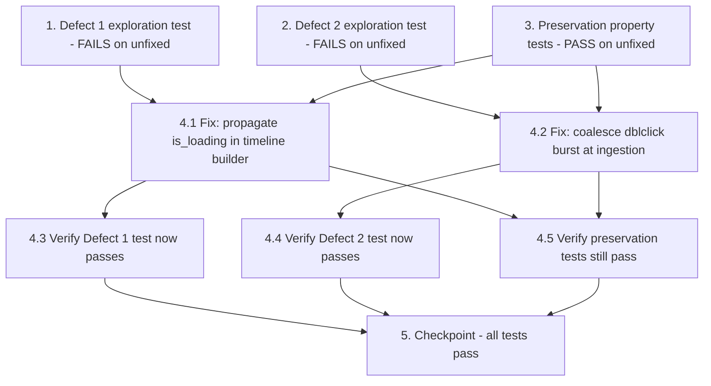

# Implementation Plan

## Overview

This plan fixes two confirmed defects in the roteiro/video pipeline using the
bug condition methodology: Defect 1 (loading/navigation steps freeze instead of
playing because `is_loading` is never propagated into `timeline_events`) and
Defect 2 (a single double-click is narrated three times because the
`click`+`click`+`dblclick` burst is never coalesced). Exploration tests are
written first to prove each bug on the UNFIXED code (Property 1, Property 2),
preservation tests pin existing behavior (Property 3), then the surgical fix is
applied in `api/rerender_pipeline.py` and `api/export_pipeline.py` and verified.

## Tasks

- [x] 1. Write Defect 1 bug condition exploration test (loading/navigation freeze)
  - **Property 1: Bug Condition** - Loading/Navigation Steps Freeze Instead of Playing
  - **CRITICAL**: This test MUST FAIL on unfixed code - failure confirms the bug exists
  - **DO NOT attempt to fix the test or the code when it fails**
  - **NOTE**: This test encodes the expected behavior - it will validate the fix when it passes after implementation
  - **GOAL**: Surface counterexamples that demonstrate the bug exists
  - **Scoped PBT Approach**: Use Hypothesis to generate roteiro steps where `isBugCondition1(step)` holds — `_simlink.action == "navigation"` (or loading-style `micro_narracao`) with `is_loading` absent/false. For the deterministic anchor, scope to the saved `sess_1780690407909` navigation steps (steps 4, 5, 9)
  - Build a `timeline_events` entry from such a step using the CURRENT builder in `api/rerender_pipeline.py` (`rerenderizar_com_roteiro_aprovado` timeline-building loop), then run `video_eng/time_bender.py::_calculate_segments([event], video_duration)`
  - Assert the Expected Behavior from design Property 1: the built `timeline_event` carries `is_loading = True` AND `_calculate_segments` emits a running `("video", ...)` segment with NO per-event `("freeze", ...)` narration segment for that event
  - Place the test alongside the existing suite (e.g. `tests/test_bug_roteiro_loading_dblclick.py`), matching the Hypothesis style of `tests/test_bug_freeze_frame_timing.py`
  - Run test on UNFIXED code
  - **EXPECTED OUTCOME**: Test FAILS (this is correct - it proves the bug exists: the navigation `timeline_event` lacks `is_loading=True` and `_calculate_segments` freezes it)
  - Document counterexamples found (e.g., "navigation step 5 builds `{timestamp, audio_path}` with no `is_loading`, so `_calculate_segments` emits a `('freeze', ...)` segment instead of `('video', ...)`")
  - Mark task complete when test is written, run, and failure is documented
  - _Requirements: 1.1, 1.2, 2.1, 2.2_

- [x] 2. Write Defect 2 bug condition exploration test (double-click triple narration)
  - **Property 2: Bug Condition** - Double-Click Burst Becomes Three Narrated Steps
  - **CRITICAL**: This test MUST FAIL on unfixed code - failure confirms the bug exists
  - **DO NOT attempt to fix the test or the code when it fails**
  - **NOTE**: This test encodes the expected behavior - it will validate the fix when it passes after implementation
  - **GOAL**: Surface counterexamples that demonstrate the bug exists
  - **Scoped PBT Approach**: Use Hypothesis to generate ordered event lists embedding a same-target `click`+`click`+`dblclick` burst within `COALESCE_WINDOW_MS` (so `isBugCondition2(events)` holds). For the deterministic anchor, scope to the `sess_1780690407909` "Financeiro" burst (steps 6/7/8, xpath `//*[@id="file_1"]/div[1]/div[2]/h1[1]`, x=233 y=723, timestamps ...405629/...405823/...405826)
  - Run the CURRENT ingestion in `api/export_pipeline.py::_renderizar_exportacao_impl` (the per-event `processar_evento` fan-out over `payload["events"]`) and count the roteiro steps and narrations produced for the burst target
  - Assert the Expected Behavior from design Property 2: the burst yields exactly ONE roteiro step (the `dblclick`) narrated exactly once
  - Run test on UNFIXED code
  - **EXPECTED OUTCOME**: Test FAILS (this is correct - it proves the bug exists: the burst produces three steps and three "Financeiro" narrations)
  - Document counterexamples found (e.g., "the click+click+dblclick 'Financeiro' burst produces 3 roteiro steps and 3 narrations instead of 1")
  - Mark task complete when test is written, run, and failure is documented
  - _Requirements: 1.3, 1.4, 2.3, 2.4_

- [x] 3. Write preservation property tests (BEFORE implementing fix)
  - **Property 3: Preservation** - Non-Buggy Inputs Are Unchanged
  - **IMPORTANT**: Follow observation-first methodology
  - Observe behavior on UNFIXED code and record actual outputs for inputs where NEITHER `isBugCondition1` NOR `isBugCondition2` holds:
    - Non-loading click timelines: observe one freeze per event (duration matching the event's TTS audio) plus the trailing final 3.5s freeze in `_calculate_segments` (reuse/extend `tests/test_preservation_freeze_frame_timing.py`)
    - Pre-flagged loading events: observe `_calculate_segments` output for events already carrying `is_loading=True` (must be identical in both the FFmpeg path and the MoviePy fallback)
    - Non-burst event lists: observe ingestion output for distinct targets, out-of-window same-target repeats, lone single clicks, and `input`/`change`/`scroll`/`navigation` events
  - Write property-based tests (Hypothesis) capturing the observed behavior patterns from the design's Preservation Requirements:
    - For non-loading click timelines: per-event freeze structure and trailing 3.5s freeze unchanged
    - For pre-flagged `is_loading=True` events: `_calculate_segments` output identical before and after
    - Coalescer identity: `coalesce_dblclick_bursts(events) == events` for all non-burst event lists
    - Single-click preservation: a lone click yields exactly one step narrated once
    - Identical step/timeline/narration counts when no loading steps and no bursts are present
  - Run tests on UNFIXED code
  - **EXPECTED OUTCOME**: Tests PASS (this confirms the baseline behavior to preserve)
  - Mark task complete when tests are written, run, and passing on unfixed code
  - _Requirements: 3.1, 3.2, 3.3, 3.4, 3.5, 3.6_

- [x] 4. Fix loading-step freeze (Defect 1) and double-click triple narration (Defect 2)

  - [x] 4.1 Propagate loading classification in the timeline builder (Defect 1)
    - In `api/rerender_pipeline.py`, add a pure, side-effect-free helper `is_loading_step(passo) -> bool` returning `True` when `passo.get("_simlink", {}).get("action") == "navigation"` (optionally also when `micro_narracao` matches a loading-narration pattern)
    - When assembling each `tts_tasks` entry, record `"is_loading": is_loading_step(passo)` alongside `texto`, `audio_path`, `rel_sec`
    - In the loop that appends to `timeline_events` for successful TTS, include `"is_loading": task_info["is_loading"]`; for non-loading steps omit the key or set it `False` so `_calculate_segments` is byte-for-byte unchanged for them
    - Do NOT modify `video_eng/time_bender.py` (`_calculate_segments`, `compose_video_with_freeze_frames`, MoviePy fallback already read `is_loading` correctly)
    - _Bug_Condition: isBugCondition1(step) — isLoadingStep(step) AND (step.is_loading absent OR false)_
    - _Expected_Behavior: built timeline_event has is_loading=True; _calculate_segments emits running ("video", ...) with no per-event ("freeze", ...) narration segment_
    - _Preservation: Preservation Requirements from design (non-loading freeze structure; pre-flagged is_loading transparency)_
    - _Requirements: 2.1, 2.2, 3.1, 3.2, 3.6_

  - [x] 4.2 Coalesce the double-click burst at ingestion (Defect 2)
    - In `api/export_pipeline.py`, add a module-level `COALESCE_WINDOW_MS` constant (e.g. 400ms, safe headroom over the observed ~197ms) and a pure `sameTarget` helper comparing `eventData.xpath` plus `target_geometry` within a small pixel tolerance
    - Add a pure `coalesce_dblclick_bursts(events, window_ms=COALESCE_WINDOW_MS) -> list`: scan the ordered list; when a `click`+`click`+`dblclick` run targets the same element and the span between the first `click` and the `dblclick` is `<= window_ms`, drop the two leading `click` events and keep only the `dblclick`; leave every other event untouched and in order
    - In `_renderizar_exportacao_impl`, replace `events = payload.get("events", [])` with `events = coalesce_dblclick_bursts(events)` BEFORE the per-event `processar_evento` fan-out, so downstream enrichment/TTS/timeline see one step (and therefore one narration) for the burst
    - Ensure the coalescer returns the input list unchanged whenever no qualifying burst exists (different targets, out-of-window spacing, lone clicks, non-click events)
    - Optional defense-in-depth (must not change forwarding of any other event type): `extension/content_scripts/radar_v3.js` may buffer same-target clicks briefly and forward only the `dblclick`; the server-side coalescer remains the authoritative, tested guarantee
    - _Bug_Condition: isBugCondition2(events) — same-target click+click+dblclick within COALESCE_WINDOW_MS_
    - _Expected_Behavior: burst coalesced to exactly ONE step (the dblclick), target narrated exactly once_
    - _Preservation: coalescer is the identity for all non-burst event lists; distinct interactions still produce one step each_
    - _Requirements: 2.3, 2.4, 3.3, 3.4, 3.5_

  - [x] 4.3 Verify Defect 1 bug condition exploration test now passes
    - **Property 1: Expected Behavior** - Loading/Navigation Steps Keep Playing
    - **IMPORTANT**: Re-run the SAME test from task 1 - do NOT write a new test
    - The test from task 1 encodes the expected behavior; when it passes it confirms loading steps build `is_loading=True` and `_calculate_segments` keeps them playing
    - Run the Defect 1 exploration test from task 1
    - **EXPECTED OUTCOME**: Test PASSES (confirms the loading-freeze bug is fixed)
    - _Requirements: 2.1, 2.2_

  - [x] 4.4 Verify Defect 2 bug condition exploration test now passes
    - **Property 2: Expected Behavior** - Double-Click Burst Narrated Once
    - **IMPORTANT**: Re-run the SAME test from task 2 - do NOT write a new test
    - The test from task 2 encodes the expected behavior; when it passes it confirms the burst coalesces to one step (the dblclick) narrated once
    - Run the Defect 2 exploration test from task 2
    - **EXPECTED OUTCOME**: Test PASSES (confirms the triple-narration bug is fixed)
    - _Requirements: 2.3, 2.4_

  - [x] 4.5 Verify preservation property tests still pass
    - **Property 3: Preservation** - Non-Buggy Inputs Are Unchanged
    - **IMPORTANT**: Re-run the SAME tests from task 3 - do NOT write new tests
    - Run the preservation property tests from task 3 (non-loading freeze structure, pre-flagged `is_loading` transparency across FFmpeg and MoviePy paths, coalescer identity on non-bursts, single-click preservation, identical step/timeline/narration counts)
    - **EXPECTED OUTCOME**: Tests PASS (confirms no regressions to `freeze-frame-timing` or distinct-interaction handling)
    - Confirm all tests still pass after the fix (no regressions)
    - _Requirements: 3.1, 3.2, 3.3, 3.4, 3.5, 3.6_

- [x] 5. Checkpoint - Ensure all tests pass
  - Run the full test suite (including `tests/test_timebender.py`, `tests/test_preservation_freeze_frame_timing.py`, and the new exploration/preservation tests)
  - Confirm Property 1 and Property 2 exploration tests pass (bugs fixed) and Property 3 preservation tests pass (no regressions)
  - Ensure all tests pass; ask the user if questions arise

## Task Dependency Graph



```json
{
  "waves": [
    {
      "wave": 1,
      "description": "Write exploration tests (fail on unfixed) and preservation tests (pass on unfixed) before any fix",
      "tasks": ["1", "2", "3"]
    },
    {
      "wave": 2,
      "description": "Apply the surgical fixes for both defects",
      "tasks": ["4.1", "4.2"]
    },
    {
      "wave": 3,
      "description": "Verify bugs are fixed and no regressions were introduced",
      "tasks": ["4.3", "4.4", "4.5"]
    },
    {
      "wave": 4,
      "description": "Final checkpoint - full suite passes",
      "tasks": ["5"]
    }
  ]
}
```

## Notes

- **Bug condition methodology**: Property 1 and Property 2 are exploration tests
  that MUST fail on the unfixed code (proving each defect). Property 3 captures
  preservation and MUST pass before and after the fix.
- **Property numbering** aligns with the design's Correctness Properties:
  Property 1 = Defect 1 bug condition, Property 2 = Defect 2 bug condition,
  Property 3 = Preservation.
- **Surgical scope**: `video_eng/time_bender.py` is intentionally NOT modified —
  `_calculate_segments` already branches on `is_loading`. The fix only adds the
  missing flag propagation (Defect 1) and the missing burst coalescing (Defect 2).
- **`COALESCE_WINDOW_MS`** is a tuning detail; 400ms gives safe headroom over the
  observed ~197ms burst span. Keep `is_loading_step`, `sameTarget`, and
  `coalesce_dblclick_bursts` pure so they are directly property-testable.
- New tests should follow the existing Hypothesis conventions in `tests/`
  (`test_bug_freeze_frame_timing.py`, `test_preservation_freeze_frame_timing.py`).
