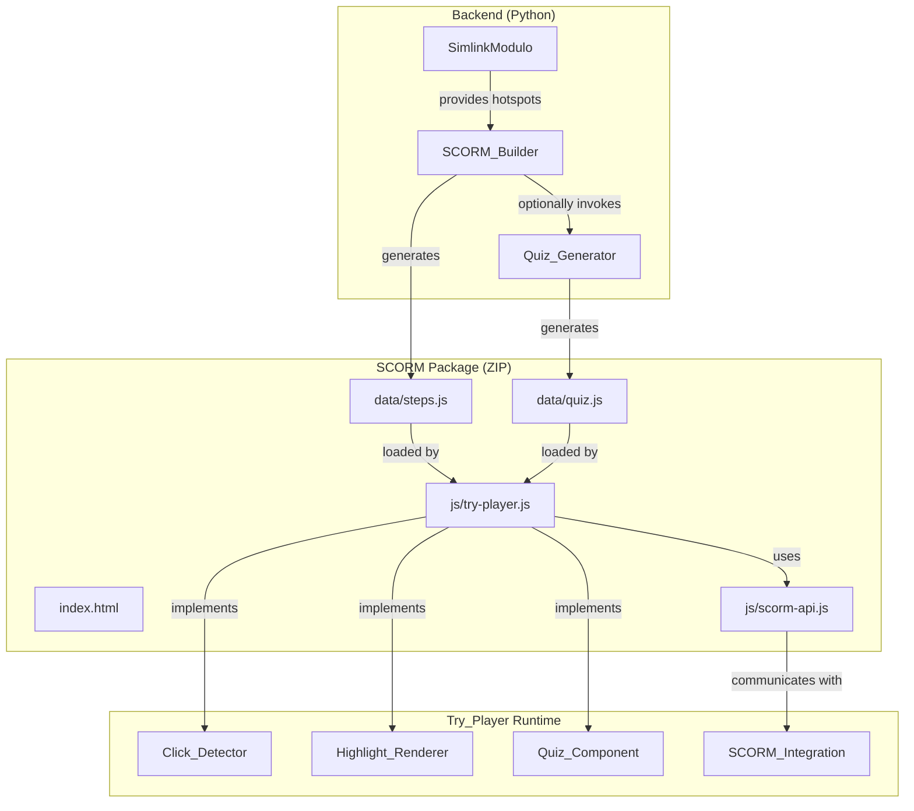
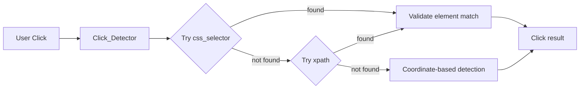
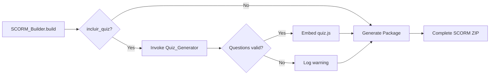

# Design Document: SCORM Builder Refinement

## Overview

This design specifies enhancements to the SCORM Builder system to improve interactive click detection precision and optionally integrate knowledge validation quizzes. The system currently uses coordinate-based click detection, which fails when screen resolutions differ from capture time. This refinement introduces selector-based detection (xpath/css_selector) with coordinate fallback, ensuring precise interaction validation and visual hints across varying display configurations.

The optional quiz integration allows administrators to include multiple-choice assessments at the end of SCORM packages, leveraging the existing Quiz_Generator system to create contextual questions based on captured workflow steps.

### Key Improvements

1. **Selector-Priority Detection**: Use DOM selectors (css_selector, xpath) to identify target elements before falling back to coordinates
2. **Precise Border Rendering**: Calculate highlight positions from actual DOM element boundaries rather than scaled coordinates
3. **Quiz Integration**: Optional end-of-module assessment with configurable question count
4. **SCORM 1.2 Compliance**: All enhancements maintain full compatibility with SCORM 1.2 standard
5. **Debug Instrumentation**: Console logging for selector resolution and fallback behavior

### System Context

**Existing Components:**
- **SCORM_Builder** (`scorm_eng/scorm_builder.py`): Generates SCORM 1.2 packages from SimlinkModulo data
- **Try_Player** (`scorm_eng/templates/js/try-player.js`): JavaScript engine executing interactive simulations
- **Quiz_Generator** (`artifacts/quiz_generator.py`): AI-powered question generation from tutorial steps
- **SimlinkModulo/SimlinkHotspot** (`contracts/simlink_models.py`): Data models containing xpath, css_selector, coordinates, and metadata

**Data Flow:**
```
Capture Session → SimlinkModulo (with selectors) → SCORM_Builder → SCORM Package (ZIP)
                                                         ↓
                                                    Quiz_Generator (optional)
                                                         ↓
                                                    quiz.js embedded
```

## Architecture

### Component Diagram



### Selector-Based Detection Architecture



### Quiz Integration Flow



## Components and Interfaces

### 1. Click_Detector Component (Try_Player)

**Responsibility:** Validate user clicks against target hotspot using selector-priority detection

**Enhanced Detection Algorithm:**

```javascript
function detectClickMatch(event, hotspot) {
    let matched = false;
    let method = 'none';
    
    // Priority 1: CSS Selector
    if (hotspot.css_selector) {
        const element = document.querySelector(hotspot.css_selector);
        if (element) {
            matched = element.contains(event.target) || element === event.target;
            method = 'css_selector';
            if (isDebugMode()) {
                console.debug(`[Click_Detector] CSS selector found: ${hotspot.css_selector}`, element);
            }
        } else if (isDebugMode()) {
            console.debug(`[Click_Detector] CSS selector not found: ${hotspot.css_selector}`);
        }
    }
    
    // Priority 2: XPath (if CSS failed)
    if (!matched && hotspot.xpath) {
        const element = getElementByXPath(hotspot.xpath);
        if (element) {
            matched = element.contains(event.target) || element === event.target;
            method = 'xpath';
            if (isDebugMode()) {
                console.debug(`[Click_Detector] XPath found: ${hotspot.xpath}`, element);
            }
        } else if (isDebugMode()) {
            console.debug(`[Click_Detector] XPath not found: ${hotspot.xpath}`);
        }
    }
    
    // Priority 3: Coordinate fallback
    if (!matched) {
        matched = detectClickByCoordinates(event, hotspot);
        method = 'coordinates';
        if (isDebugMode()) {
            console.debug(`[Click_Detector] Fallback to coordinate detection:`, matched);
        }
    }
    
    return { matched, method };
}
```

**Interface:**

```typescript
interface ClickDetectorResult {
    matched: boolean;
    method: 'css_selector' | 'xpath' | 'coordinates';
}

function detectClickMatch(
    event: MouseEvent, 
    hotspot: SimlinkHotspot
): ClickDetectorResult;
```

**Key Functions:**

- `getElementByXPath(xpath: string): Element | null` - XPath evaluation helper
- `detectClickByCoordinates(event: MouseEvent, hotspot: SimlinkHotspot): boolean` - Existing coordinate logic (preserved)
- `isDebugMode(): boolean` - Returns `!ScormAPI.isLMS` to enable debug logs in standalone mode

### 2. Highlight_Renderer Component (Try_Player)

**Responsibility:** Draw visual borders (hints/reveals) precisely aligned with target elements

**Enhanced Rendering Algorithm:**

```javascript
function renderHighlight(hotspot, cssClass) {
    let bounds = null;
    let method = 'none';
    
    // Priority 1: CSS Selector
    if (hotspot.css_selector) {
        const element = document.querySelector(hotspot.css_selector);
        if (element) {
            bounds = element.getBoundingClientRect();
            method = 'css_selector';
            if (isDebugMode()) {
                console.debug(`[Highlight_Renderer] Using CSS bounds:`, bounds);
            }
        }
    }
    
    // Priority 2: XPath
    if (!bounds && hotspot.xpath) {
        const element = getElementByXPath(hotspot.xpath);
        if (element) {
            bounds = element.getBoundingClientRect();
            method = 'xpath';
            if (isDebugMode()) {
                console.debug(`[Highlight_Renderer] Using XPath bounds:`, bounds);
            }
        }
    }
    
    // Priority 3: Coordinate scaling
    if (!bounds && hotspot.coordinates) {
        bounds = calculateScaledBounds(hotspot.coordinates);
        method = 'coordinates';
        if (isDebugMode()) {
            console.debug(`[Highlight_Renderer] Using scaled coordinates:`, bounds);
        }
    }
    
    if (bounds) {
        drawHighlightBox(bounds, cssClass, hotspot);
    }
}
```

**Interface:**

```typescript
interface HighlightBounds {
    left: number;
    top: number;
    width: number;
    height: number;
}

function renderHighlight(
    hotspot: SimlinkHotspot,
    cssClass: 'hint' | 'reveal' | 'success'
): void;

function calculateScaledBounds(
    coordinates: Coordinates
): HighlightBounds;
```

**Key Considerations:**

- `getBoundingClientRect()` returns viewport-relative coordinates; must account for image container offset
- Coordinate fallback must scale `{x, y, w, h}` proportionally to rendered image size
- Preserve existing animation transitions and styling

### 3. Quiz_Component (Try_Player)

**Responsibility:** Render and manage end-of-module quiz UI

**Component Structure:**

```javascript
const QuizComponent = {
    data: [],           // QUIZ_DATA loaded from quiz.js
    currentIndex: 0,
    userAnswers: [],
    
    init() {
        if (typeof QUIZ_DATA === 'undefined') {
            console.warn('[Quiz_Component] quiz.js not found, skipping quiz');
            return false;
        }
        
        if (!this.validateQuizData(QUIZ_DATA)) {
            console.error('[Quiz_Component] Invalid quiz data structure');
            return false;
        }
        
        this.data = QUIZ_DATA;
        this.userAnswers = new Array(this.data.length).fill(null);
        return true;
    },
    
    validateQuizData(data) {
        if (!Array.isArray(data) || data.length === 0) return false;
        return data.every(q => 
            q.pergunta && 
            Array.isArray(q.opcoes) && 
            q.opcoes.length === 4 &&
            typeof q.correta === 'number' &&
            q.correta >= 0 && q.correta < 4
        );
    },
    
    render() {
        // Render current question with options
    },
    
    selectAnswer(optionIndex) {
        this.userAnswers[this.currentIndex] = optionIndex;
    },
    
    next() {
        if (this.currentIndex < this.data.length - 1) {
            this.currentIndex++;
            this.render();
        } else {
            this.showResults();
        }
    },
    
    calculateScore() {
        let correct = 0;
        this.data.forEach((q, i) => {
            if (this.userAnswers[i] === q.correta) correct++;
        });
        return Math.round((correct / this.data.length) * 100);
    },
    
    showResults() {
        const score = this.calculateScore();
        // Display results with color-coded feedback
        // Save score to SCORM
        this.saveQuizScore(score);
    },
    
    saveQuizScore(percentage) {
        const currentRaw = ScormAPI.get("cmi.core.score.raw");
        const xpSimulation = parseInt(currentRaw) || state.xpTotal;
        const combinedScore = `${xpSimulation}|${percentage}`;
        ScormAPI.set("cmi.core.score.raw", combinedScore);
        
        // Update suspend_data with quiz answers
        const suspendData = JSON.parse(ScormAPI.get("cmi.suspend_data") || "{}");
        suspendData.quizAnswers = this.userAnswers;
        suspendData.quizScore = percentage;
        ScormAPI.set("cmi.suspend_data", JSON.stringify(suspendData));
        ScormAPI.save();
    }
};
```

**Interface:**

```typescript
interface QuizData {
    pergunta: string;
    opcoes: string[];      // Array of 4 options
    correta: number;       // Index 0-3 of correct answer
    explicacao: string;
}

interface QuizComponent {
    data: QuizData[];
    currentIndex: number;
    userAnswers: (number | null)[];
    
    init(): boolean;
    validateQuizData(data: any): boolean;
    render(): void;
    selectAnswer(optionIndex: number): void;
    next(): void;
    calculateScore(): number;  // Returns 0-100
    showResults(): void;
    saveQuizScore(percentage: number): void;
}
```

### 4. SCORM_Builder Enhancements

**New Parameters:**

```python
class ScormBuilder:
    def __init__(
        self, 
        simlink_modulo: SimlinkModulo, 
        session_id: str, 
        titulo: str,
        incluir_quiz: bool = False,
        num_questoes_quiz: int = 3
    ):
        self.simlink_modulo = simlink_modulo
        self.session_id = session_id
        self.titulo = titulo
        self.incluir_quiz = incluir_quiz
        self.num_questoes_quiz = self._validate_num_questoes(num_questoes_quiz)
        self.output_base = Path("data/scorm")
```

**Enhanced Build Method:**

```python
async def build(self) -> str:
    """Generate SCORM package with optional quiz"""
    self.output_base.mkdir(parents=True, exist_ok=True)
    zip_path = self.output_base / f"{self.session_id}.zip"
    
    # Generate quiz if requested
    quiz_data = []
    if self.incluir_quiz:
        quiz_data = await self._generate_quiz()
    
    with zipfile.ZipFile(zip_path, 'w', zipfile.ZIP_DEFLATED) as zipf:
        # Existing files (manifest, steps.js, screenshots, templates)
        self._write_manifest(zipf)
        self._write_steps(zipf)
        self._write_assets(zipf)
        self._write_templates(zipf)
        
        # New: Write quiz.js if available
        if quiz_data:
            self._write_quiz(zipf, quiz_data)
            self._update_manifest_for_quiz(zipf)
    
    return str(zip_path)

async def _generate_quiz(self) -> list:
    """Invoke Quiz_Generator with error handling"""
    from artifacts.quiz_generator import gerar_quiz
    
    # Extract roteiro from hotspots
    roteiro = [
        {
            "passo": h.passo_num,
            "ancora": h.ancora,
            "micro_narracao": h.micro_narracao
        }
        for h in self.simlink_modulo.hotspots
    ]
    
    try:
        logger.info(f"[{self.session_id}] Generating quiz with {self.num_questoes_quiz} questions")
        quiz_data = await gerar_quiz(roteiro, num_questoes=self.num_questoes_quiz)
        
        if not quiz_data or len(quiz_data) == 0:
            logger.warning(f"[{self.session_id}] Quiz_Generator returned empty list")
            return []
        
        logger.info(f"[{self.session_id}] Quiz generated successfully: {len(quiz_data)} questions")
        return quiz_data
        
    except Exception as e:
        logger.error(f"[{self.session_id}] Failed to generate quiz: {e}")
        return []

def _write_quiz(self, zipf: zipfile.ZipFile, quiz_data: list):
    """Write quiz.js to SCORM package"""
    js_content = f"const QUIZ_DATA = {json.dumps(quiz_data, ensure_ascii=False, indent=2)};"
    zipf.writestr('data/quiz.js', js_content)

def _validate_num_questoes(self, num: int) -> int:
    """Validate and clamp num_questoes_quiz to valid range"""
    if num < 1 or num > 10:
        logger.warning(f"num_questoes_quiz={num} out of range [1,10], using default=3")
        return 3
    return num
```

**Updated Function Signature:**

```python
async def gerar_scorm(
    simlink_modulo: SimlinkModulo, 
    session_id: str, 
    titulo: str,
    incluir_quiz: bool = False,
    num_questoes_quiz: int = 3
) -> str:
    """Generate SCORM 1.2 package with optional quiz integration"""
    logger.info(f"Generating SCORM package for session {session_id}...")
    builder = ScormBuilder(
        simlink_modulo, 
        session_id, 
        titulo, 
        incluir_quiz, 
        num_questoes_quiz
    )
    return await builder.build()
```

## Data Models

### Enhanced SimlinkHotspot (No changes required)

```python
class SimlinkHotspot(BaseModel):
    """Hotspot with selector data already present"""
    passo_num: int
    xpath: str                  # Available for detection
    css_selector: str           # Available for detection
    coordinates: Dict[str, float]  # {x, y, w, h} - fallback
    target_text: str
    action: str
    url: str = ""
    screenshot_path: str
    ancora: str
    micro_narracao: str
    audio_path: Optional[str] = None
```

### Quiz Data Schema

```typescript
interface QuizQuestion {
    pergunta: string;       // Question text
    opcoes: string[];       // Array of 4 option strings
    correta: number;        // Index (0-3) of correct answer
    explicacao: string;     // Explanation of correct answer
}

// quiz.js exports:
const QUIZ_DATA: QuizQuestion[];
```

**Example:**

```javascript
const QUIZ_DATA = [
    {
        "pergunta": "Qual é o objetivo principal do botão 'Salvar' no formulário?",
        "opcoes": [
            "Persistir os dados no sistema",
            "Validar os campos apenas",
            "Fechar o formulário",
            "Enviar email de confirmação"
        ],
        "correta": 0,
        "explicacao": "O botão Salvar persiste os dados no banco de dados, garantindo que as informações sejam armazenadas."
    }
];
```

### SCORM Data Format Extensions

**cmi.core.score.raw format with quiz:**

```
"{xp_simulation}|{quiz_percentage}"

Example: "84|75" 
// 84 XP from simulation, 75% correct on quiz
```

**cmi.suspend_data format with quiz:**

```json
{
    "passoAtual": 10,
    "xpTotal": 84,
    "sequenciaPerfeita": false,
    "historico": [...],
    "quizAnswers": [0, 2, 1],
    "quizScore": 75
}
```

**Size Management:**

SCORM 1.2 limits `cmi.suspend_data` to 4096 characters. If exceeded:
1. Prioritize: `passoAtual`, `xpTotal`, `quizScore`
2. Truncate: `historico` (keep last 5 entries)
3. Optional: Base64 compress or omit `quizAnswers` array

## Error Handling

### Selector Detection Failures

**Scenario:** Both css_selector and xpath fail to locate element

**Handling:**
1. Log failure reason to console (debug mode only)
2. Fallback to coordinate-based detection
3. Continue execution without error propagation

**Code:**

```javascript
if (!element && isDebugMode()) {
    console.debug(`[Click_Detector] Selector failed, using coordinate fallback for hotspot ${hotspot.passo_num}`);
}
```

### Quiz Generation Failures

**Scenario:** Quiz_Generator times out or returns empty array

**Handling:**
1. Log warning to server logs
2. Generate SCORM package without quiz.js
3. Try_Player gracefully skips quiz phase if QUIZ_DATA undefined

**Code:**

```python
try:
    quiz_data = await asyncio.wait_for(
        self._generate_quiz(), 
        timeout=60.0
    )
except asyncio.TimeoutError:
    logger.warning(f"[{self.session_id}] Quiz generation timeout, proceeding without quiz")
    quiz_data = []
except Exception as e:
    logger.error(f"[{self.session_id}] Quiz generation error: {e}")
    quiz_data = []
```

### Quiz Data Validation Failures

**Scenario:** QUIZ_DATA malformed or missing required fields

**Handling:**
1. Validate structure before rendering
2. Log error to console
3. Skip quiz and proceed to completion screen

**Code:**

```javascript
if (!QuizComponent.init()) {
    console.error('[Quiz_Component] Invalid or missing quiz data, skipping to completion');
    concluirModulo();
    return;
}
```

### SCORM suspend_data Size Limit

**Scenario:** Suspend data exceeds 4096 characters

**Handling:**
1. Detect size before saving
2. Compress by truncating historico array
3. If still too large, omit quizAnswers array
4. Log truncation warning

**Code:**

```javascript
function salvarProgresso() {
    let saveData = {
        passoAtual: state.passoAtual,
        xpTotal: state.xpTotal,
        sequenciaPerfeita: state.sequenciaPerfeita,
        historico: state.historico,
        quizAnswers: QuizComponent.userAnswers,
        quizScore: QuizComponent.calculateScore()
    };
    
    let jsonStr = JSON.stringify(saveData);
    
    // Truncate if exceeds SCORM 1.2 limit
    if (jsonStr.length > 4096) {
        // Keep only last 5 historico entries
        saveData.historico = saveData.historico.slice(-5);
        jsonStr = JSON.stringify(saveData);
        
        if (jsonStr.length > 4096) {
            // Remove quizAnswers if still too large
            delete saveData.quizAnswers;
            jsonStr = JSON.stringify(saveData);
            console.warn('[SCORM] suspend_data truncated to fit 4096 char limit');
        }
    }
    
    ScormAPI.set("cmi.suspend_data", jsonStr);
    // ... rest of save logic
}
```

### XPath Evaluation Errors

**Scenario:** Invalid XPath syntax or browser compatibility issues

**Handling:**
1. Wrap XPath evaluation in try-catch
2. Return null on error
3. Fallback to coordinate detection

**Code:**

```javascript
function getElementByXPath(xpath) {
    try {
        const result = document.evaluate(
            xpath,
            document,
            null,
            XPathResult.FIRST_ORDERED_NODE_TYPE,
            null
        );
        return result.singleNodeValue;
    } catch (e) {
        if (isDebugMode()) {
            console.warn(`[Click_Detector] XPath evaluation error: ${e.message}`);
        }
        return null;
    }
}
```

## Testing Strategy

**Note on Property-Based Testing**: PBT is not applicable to this feature because it involves Infrastructure as Code patterns (SCORM package generation with ZIP files and XML manifests), UI rendering operations (DOM manipulation and visual positioning), side-effect operations (file I/O, SCORM API calls), and non-deterministic AI integration (LLM-based quiz generation). These characteristics are best validated through example-based unit tests, integration tests, and compliance checks rather than universal property assertions.

### Unit Testing

**Python (SCORM_Builder):**

1. **test_scorm_builder_quiz_integration**
   - Verify `incluir_quiz=True` invokes Quiz_Generator
   - Verify quiz.js is written to package when questions exist
   - Verify package generated without quiz.js when Quiz_Generator returns empty

2. **test_scorm_builder_quiz_validation**
   - Verify `num_questoes_quiz` clamped to [1, 10]
   - Verify default value of 3 used when out of range
   - Verify warning logged for invalid values

3. **test_quiz_js_format**
   - Verify quiz.js contains valid JavaScript
   - Verify QUIZ_DATA matches expected schema
   - Verify JSON escaping for special characters

4. **test_manifest_update_with_quiz**
   - Verify imsmanifest.xml includes quiz.js reference
   - Verify manifest validates against SCORM 1.2 schema

**JavaScript (Try_Player):**

1. **test_click_detector_css_priority**
   - Given: hotspot with css_selector
   - When: click on element
   - Then: detection uses CSS method

2. **test_click_detector_xpath_fallback**
   - Given: hotspot with invalid css_selector and valid xpath
   - When: click on element
   - Then: detection uses XPath method

3. **test_click_detector_coordinate_fallback**
   - Given: hotspot with no valid selectors
   - When: click in coordinate range
   - Then: detection uses coordinate method

4. **test_highlight_renderer_selector_bounds**
   - Given: hotspot with valid css_selector
   - When: rendering hint
   - Then: bounds calculated from getBoundingClientRect()

5. **test_quiz_component_validation**
   - Given: malformed QUIZ_DATA
   - When: QuizComponent.init() called
   - Then: returns false and logs error

6. **test_quiz_score_persistence**
   - Given: completed quiz with 75% correct
   - When: saveQuizScore() called
   - Then: cmi.core.score.raw contains "XP|75" format

7. **test_suspend_data_truncation**
   - Given: suspend data exceeds 4096 chars
   - When: salvarProgresso() called
   - Then: historico truncated, data fits limit

### Integration Testing

1. **test_end_to_end_quiz_flow**
   - Generate SCORM package with quiz
   - Load package in test LMS environment
   - Complete simulation steps
   - Answer quiz questions
   - Verify SCORM data persisted correctly

2. **test_selector_precision_across_resolutions**
   - Load SCORM package with selector-based hotspots
   - Test on resolutions: 1280x720, 1920x1080, 2560x1440
   - Verify click detection accuracy > 95%
   - Verify highlight borders align within 5px tolerance

3. **test_legacy_package_compatibility**
   - Load pre-existing SCORM package (coordinate-only)
   - Verify Try_Player functions without errors
   - Verify coordinate-based detection still works

4. **test_quiz_generator_timeout**
   - Mock Quiz_Generator to timeout
   - Verify SCORM package generated without quiz
   - Verify warning logged

### Manual Testing Checklist

- [ ] Visual verification: Highlight borders align precisely on various screen sizes
- [ ] User experience: Quiz questions are readable and unambiguous
- [ ] SCORM compliance: Package uploads and runs in Senior X Learning LMS
- [ ] Debug logs: Console messages appear in standalone mode, hidden in LMS mode
- [ ] Backward compatibility: Old SCORM packages load and run correctly
- [ ] Error recovery: Quiz failures don't block package generation
- [ ] Score reporting: Combined XP|quiz score displays correctly in LMS

