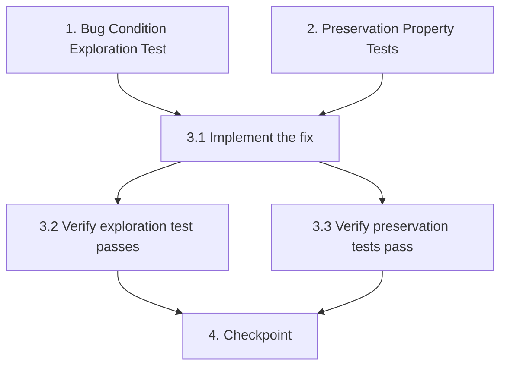

# Implementation Plan

## Overview

Bugfix implementation tasks for the TTS pronunciation issue where the word "SIGN" lacks a phonetic correction rule in `video_eng/tts_generator.py`. The fix adds a regex substitution (`(?i)\bsign\b` → "sáin") to correct pronunciation for Portuguese TTS voices. Tasks follow the exploratory bugfix workflow: explore the bug, preserve existing behavior, implement the fix, and validate.

## Tasks

- [x] 1. Write bug condition exploration test
  - **Property 1: Bug Condition** - SIGN Phonetic Correction Missing
  - **CRITICAL**: This test MUST FAIL on unfixed code - failure confirms the bug exists
  - **DO NOT attempt to fix the test or the code when it fails**
  - **NOTE**: This test encodes the expected behavior - it will validate the fix when it passes after implementation
  - **GOAL**: Surface counterexamples that demonstrate the bug exists
  - **Scoped PBT Approach**: Scope the property to concrete failing cases: text containing "sign" as a standalone word (any case) with surrounding context
  - Extract the phonetic correction logic from `gerar_audio` in `video_eng/tts_generator.py` into a testable helper (or test against the regex block directly)
  - Test that for any text matching `(?i)\bsign\b`, the corrected output should NOT contain standalone "sign" and SHOULD contain "sáin" (from Bug Condition in design)
  - Test cases: `"Click the SIGN button"`, `"The sign indicates danger"`, `"Sign here please"`, `"SIGN the sign"`
  - Use Hypothesis with `@given` strategy generating text containing standalone "sign" in various cases
  - Run test on UNFIXED code
  - **EXPECTED OUTCOME**: Test FAILS (this is correct - it proves the bug exists because no regex rule corrects "sign")
  - Document counterexamples found (e.g., `"Click the SIGN button"` passes through with "SIGN" unchanged instead of being replaced with "sáin")
  - Mark task complete when test is written, run, and failure is documented
  - _Requirements: 1.1, 2.1_

- [x] 2. Write preservation property tests (BEFORE implementing fix)
  - **Property 2: Preservation** - Existing Corrections and Substring Safety
  - **IMPORTANT**: Follow observation-first methodology
  - Observe behavior on UNFIXED code for non-buggy inputs (texts that do NOT contain standalone "sign")
  - Observe: `"This is a design pattern"` → "design" unchanged on unfixed code
  - Observe: `"Send a signal now"` → "signal" unchanged on unfixed code
  - Observe: `"Assign the task"` → "assign" unchanged on unfixed code
  - Observe: `"The GED senior template"` → "gédi", "Sênior", "têmpleit" applied on unfixed code
  - Observe: `"foo_bar | baz"` → underscore and pipe substitutions applied on unfixed code
  - Observe: `"O sistema está funcionando"` → no changes on unfixed code
  - Write property-based test using Hypothesis: for all text strings where `(?i)\bsign\b` does NOT match, assert `apply_phonetic_corrections_original(text) == apply_phonetic_corrections_fixed(text)`
  - Write property-based test: for all words containing "sign" as substring ("design", "signal", "assign", "resignation", "signage"), assert they remain unchanged after correction
  - Write property-based test: for all existing correction words ("GED", "senior", "X", "template", "templates"), assert existing corrections still apply correctly
  - Verify tests PASS on UNFIXED code
  - **EXPECTED OUTCOME**: Tests PASS (this confirms baseline behavior to preserve)
  - Mark task complete when tests are written, run, and passing on unfixed code
  - _Requirements: 3.1, 3.2, 3.3, 3.4, 3.5_

- [x] 3. Fix for SIGN mispronunciation in TTS phonetic corrections

  - [x] 3.1 Implement the fix
    - Add `texto_falado = re.sub(r"(?i)\bsign\b", "sáin", texto_falado)` in `video_eng/tts_generator.py`
    - Place the new regex substitution after the existing `templates?` correction line in the `gerar_audio` function
    - Ensure word boundaries `\b` prevent matching "design", "signal", "assign", "resignation", "signage"
    - No other changes required — cache, provider logic, and all other corrections remain untouched
    - _Bug_Condition: isBugCondition(input) where input contains regex match (?i)\bsign\b_
    - _Expected_Behavior: All standalone occurrences of "sign" (any case) replaced with "sáin" in texto_falado_
    - _Preservation: Existing phonetic corrections, anti-stutter rules, cache behavior, and substring words unchanged_
    - _Requirements: 1.1, 2.1, 3.1, 3.2, 3.3, 3.4, 3.5_

  - [x] 3.2 Verify bug condition exploration test now passes
    - **Property 1: Expected Behavior** - SIGN Phonetic Correction Applied
    - **IMPORTANT**: Re-run the SAME test from task 1 - do NOT write a new test
    - The test from task 1 encodes the expected behavior (standalone "sign" → "sáin")
    - When this test passes, it confirms the expected behavior is satisfied
    - Run bug condition exploration test from step 1
    - **EXPECTED OUTCOME**: Test PASSES (confirms bug is fixed)
    - _Requirements: 2.1_

  - [x] 3.3 Verify preservation tests still pass
    - **Property 2: Preservation** - Existing Corrections and Substring Safety
    - **IMPORTANT**: Re-run the SAME tests from task 2 - do NOT write new tests
    - Run preservation property tests from step 2
    - **EXPECTED OUTCOME**: Tests PASS (confirms no regressions)
    - Confirm all tests still pass after fix (no regressions to "design", "signal", existing corrections, anti-stutter rules)

- [x] 4. Checkpoint - Ensure all tests pass
  - Ensure all tests pass, ask the user if questions arise.

## Task Dependency Graph



```json
{
  "waves": [
    {"tasks": ["1", "2"]},
    {"tasks": ["3.1"]},
    {"tasks": ["3.2", "3.3"]},
    {"tasks": ["4"]}
  ]
}
```

## Notes

- This is a single-line regex addition fix. The primary complexity is in testing, not implementation.
- Property-based tests use Python Hypothesis library for generation strategies.
- The exploration test (task 1) is expected to FAIL before the fix and PASS after — this is the intended behavior.
- Preservation tests (task 2) should PASS both before and after the fix.
- Word boundary anchors (`\b`) are critical to avoid false matches on substring words like "design", "signal", "assign".
